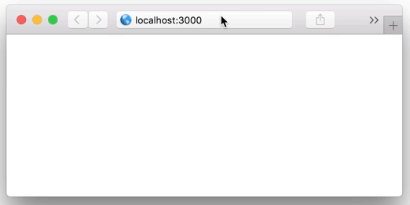

---

title: Streaming CSV with Rails
date: 2017-06-28
tags: rails, csv, streaming
description: Stream CSV files lazily using Rails, Rack, an Enumerator and HTTP headers

---

I have run into countless situations where I had to find a way to download
really large CSV files without closing a connection, so I thought I'd take some
time to share how you can do that!

### Why do I need to stream a CSV file?

I have a report that takes 30 seconds to run and I can't email because I don't
have access to that information. After 30 seconds, browsers and servers alike
tend to assume the connection is dead and kill it. This will result in 504
Gateway issues, frustrating users.

An easy workaround to this is to tell the connection "hey, I'm workin' here" and
continously send chunks of a CSV file down the pipe.

### What is a streaming (chunked) response?

Rather than waiting for the full contents to be available before showing the
client our work, we're telling them upfront "This is WIP, don't judge it yet"
and feeding them small pieces of CSV, along with the chunk size so they know it
wasn't accidental.


Once the download is done, the server tells the client it's done, the client
closes the connection and takes the CSV pieces and squashes them together into
one file.

### Ok, got it. So how do I do it?

Rails runs Rack under the hood for its server needs. Rack will infer based off
of these pieces of information that you want to stream a file:

```rb
# Headers
headers.delete("Content-Length")
headers["Cache-Control"] = "no-cache"
# Body
self.response_body = <#Enumerable>
response.status = 200
```

Now, if you pass an array as your response body, you're still waiting for the
array to complete before rendering, so what you want is an object that can
evaluate whilst filling up the queue. Luckily, Rails ships with an object that
enables this:

```rb
# The insides of this block don't execute until Rack
# yields to it at the end of the response cycle
enum = Enumerator.new do |yielder|
  pages.each do |page|
    yielder << slow_transaction.body
  end
end
```

One small gotcha is that you need to be running HTTP 1.1+ in order to support
chunked streaming - oh, and the WEBrick server won't support this.


But wait, this isn't quite what we want. This doesn't look like a CSV, and it's
not downloading like we want. Plus, we want to have a filename here.

Let's put in some additional headers and get all of that:

```rb
headers["Content-Type"] = "text/csv"
headers["Content-Disposition"] = "attachment; filename=\"example.csv\""
```

Finally, let's make sure nothing is buffered by proxy servers:

```rb
headers["X-Accel-Buffering"] = "no"
```




That was easy! Here's the full controller that's powering this:

```rb
require 'csv'

class StreamingController < ApplicationController
  def download
    # Tell Rack to stream the content
    headers.delete("Content-Length")

    # Don't cache anything from this generated endpoint
    headers["Cache-Control"] = "no-cache"

    # Tell the browser this is a CSV file
    headers["Content-Type"] = "text/csv"

    # Make the file download with a specific filename
    headers["Content-Disposition"] = "attachment; filename=\"example.csv\""

    # Don't buffer when going through proxy servers
    headers["X-Accel-Buffering"] = "no"

    # Set an Enumerator as the body
    self.response_body = body

    # Set the status to success
    response.status = 200
  end

  private

  def body
    Enumerator.new do |yielder|
      20.times do |num|
        sleep 0.05
        yielder << CSV.generate_line([num, "yay"])
      end
    end
  end
end
```

Thanks for reading! I look forward to hearing about your uses of the above!

You can find a repo with a working rails application
[here](https://github.com/berfarah/rails-streaming-example).
